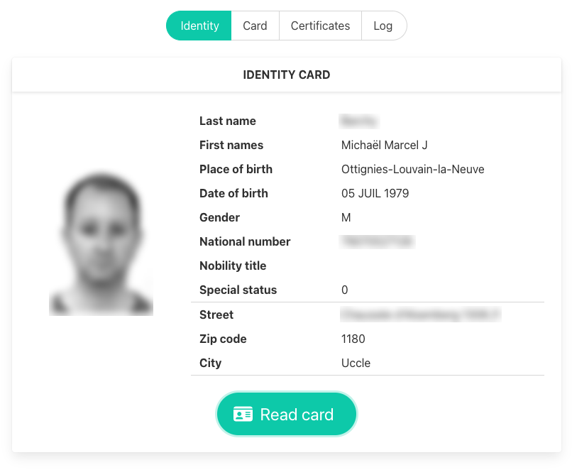

# Open e-ID

Under construction

* [Simple test](https://e-id.github.io/test.html)
* [Open e-ID viewer](https://e-id.github.io/viewer)

## Simple test

The is a simple HTML page calling the app and displaying the raw result.

The script supports both "on load" and "hidden/app" modes.

## Open e-ID viewer

The e-ID viewer is a full-featured web app with the following features:

* Read card content (data, photo & certificates)
* Print the card content (print from browser)

[More screenshots](https://github.com/e-id/e-id.github.io/tree/main/shots)

The viewer uses:

* Bulma https://bulma.io/
